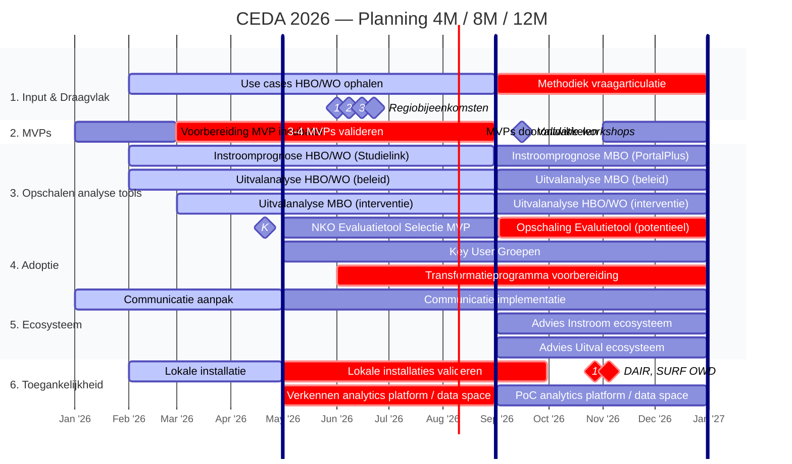

# CEDA 2026 — Planning 4M / 8M / 12M

> **Project:** Centre for Educational Data Analytics — Fase 2
> **Periode:** 1 januari 2026 – 31 december 2026

---

## Gantt chart

#### DAIR, SURF OWD
- Bij allebei zit Corneel in programmacommissie
- **Deadlines voor aanmelden zijn begin juni**
- OWD heeft pecha kucha (presentatie van <7 minuten)
- Voor DAIR hoop ik op 2 hands-on GenAI workshops van anderhalf uur
  - Voor Analytics mensen
  - Voor IR / Beleid mensen
- Ik wil vervolgens (in 2027) naar soort 'Lab' of 'Werkplaats' waar collega's van instellingen obv CEDA standaarden en misschien op CEDA github hun eigen challenges oplossen en op elkaars oplossingen voortbouwen.

#### 3-4 MVPs valideren. Dit gaat om:
- Alan (Data-driven AI alignment with education)
- Shirley (Skillsradar - met MBO Data coalitie)
  - **Hier is misschien hulp nodig in mei & juni**
- Ed (Samenwijzer - met MBO Data coalitie)
- Hibo (Doorstroom mbo obv markov chains)

#### Opschaling Evalutietool (potentieel)
- Het NKO heeft al aangegeven graag te willen opschalen en hiervoor budget te hebben
- Dit regelen vergt echter wat organisatorisch handwerk
- Dit zal in mei of juni duidelijk worden

#### Transformatieprogramma voorbereiding
- Samen met Amir willen we een plan maken om instellingen / teams aan te sluiten.
- Dit zou dan in 20227 echt van start moeten gaan.
- Per mbo / hbo / wo 2 instellingen. Vooral hbo moet ik nog even over nadenken
- Het liefst instellingen met zowel Python/R skills als goede structuur

#### Methodiek vraagarticulatie
- We hebben vorig jaar en dit jaar use cases opgehaald.
- Tegelijkertijd zijn er ook veel andere manieren om behoeftes op te halen.
  - Bijv. via sectoraanvoerders (bestuurlijk) of project DiDeMa (contact vanuit Npuls met midden-management).

#### Lokale installaties valideren
- Dit kunnen we doen door middel van workshops op onze andere tools.
- Dit is misschien wel het meest belangrijk, omdat het nog even gaat duren voor instellingen 'op productie' analytics platform kunnen gebruiken.

#### Verkennen analytics platform / data space
- Naast SURF Developer Platform is er ook team dat experimenteert met een open source Data Lake House als dienst
- Daarbij is het naast techniek ook veel afstemming binnen SURF
  - **Deze afstemming valt buiten CEDA maar binnen het subdomein 'AI & Data Voorzieningen' en is nog niet goed ingeregeld**

## Niet op roadmap 2026

#### Learning Analytics & AI en Data in het leerproces
Nu hebben we met Alan Berg iemand die een echt vernieuwend project doet. Rondom het analytics platform ben ik ook gevraagd mee te denken met Learning Analytics use cases. Voor de langere termijn is Learning Analytics ook in scope van CEDA, maar dit was er voor 2026 nog buiten gehouden.

De contactpersonen bij instellingen voor dit soort onderwerpen zijn vaak niet IR/Analytics/BI, maar meer CTLs en ICT/Innovatie in onderwijs specialisten. Mogelijk dat we hier in tweede helft van dit jaar toch al meer mee gaan experimenteren.

#### Opgekomen ideeën
We hebben ook pitches over NSE en gebruiken open data. Dat zijn echt goede ideeën, maar geen dingen die we beloofd hebben. Laten we dus in ieder geval onze doelen halen en als we bijv. in de zomer weinig feedback van gebruikers krijgen op onze hoofddoelen, dan kunnen we tijd hiervoor maken. Ook hiervoor geldt dat als er extra budget en menskracht komt, we dit mogelijk eerder kunnen oppakken.
